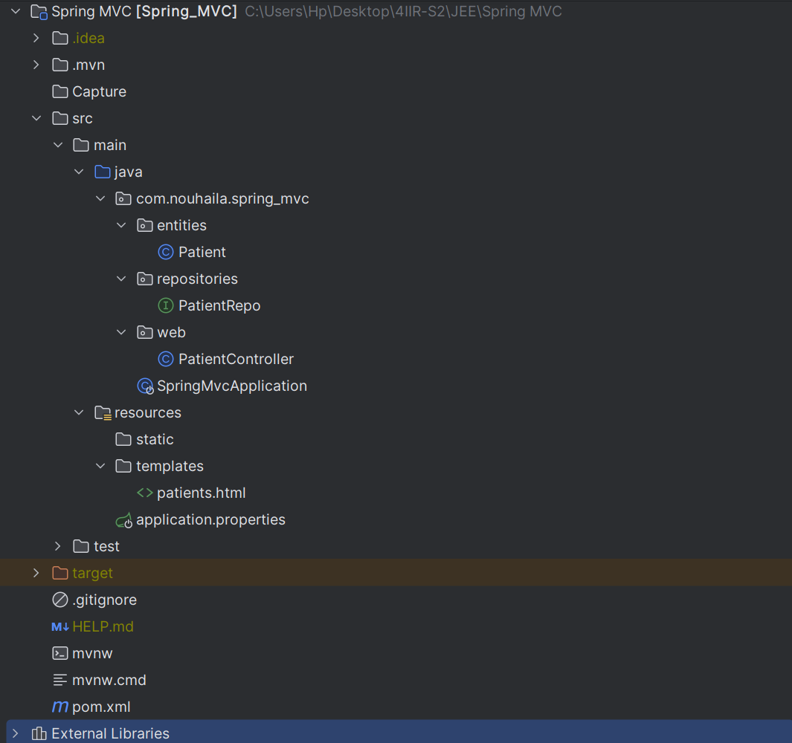
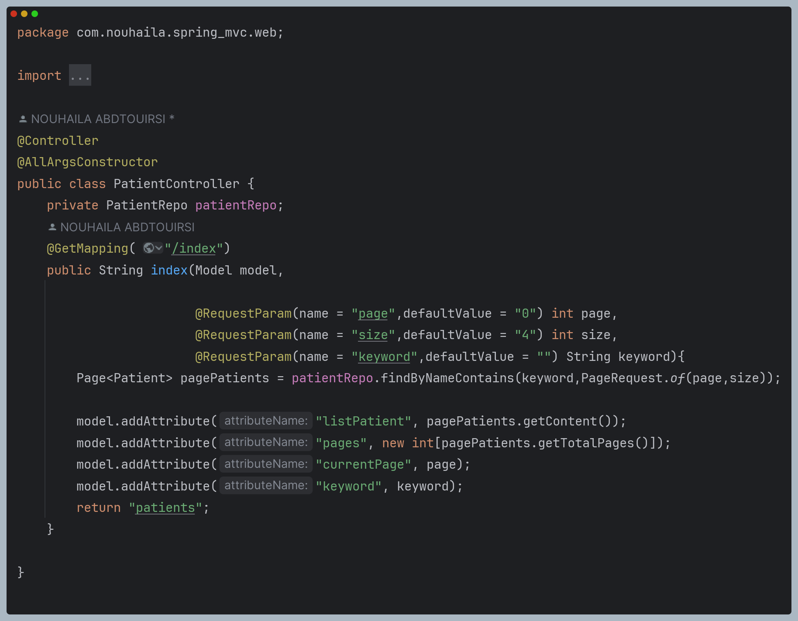
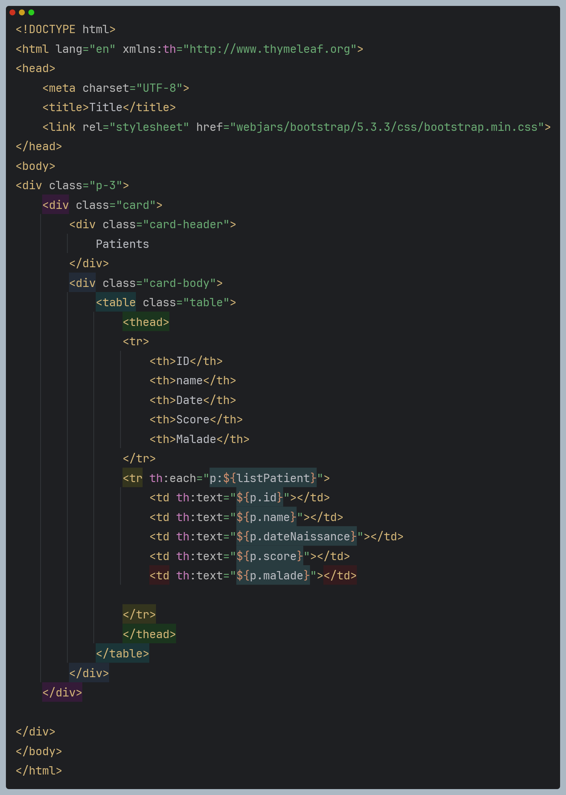
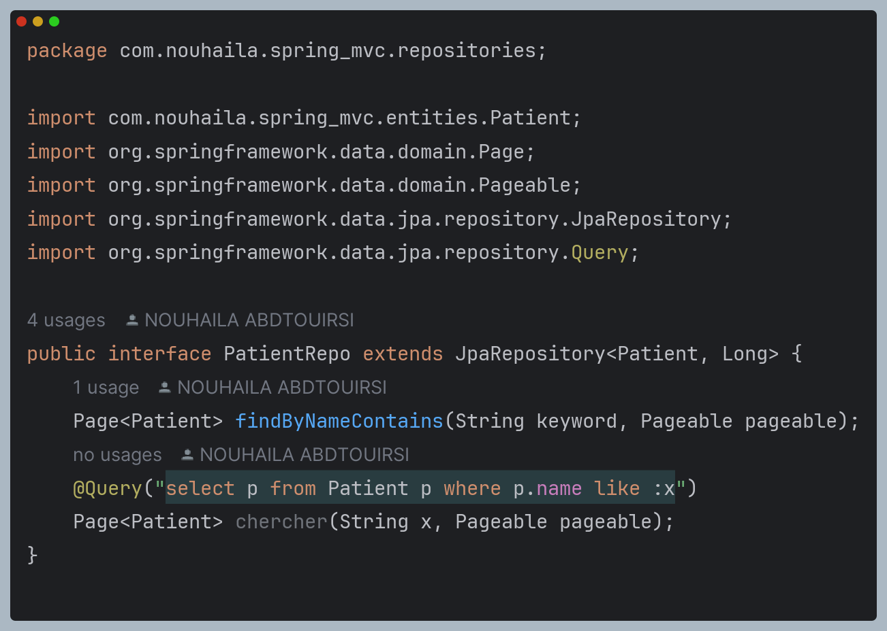
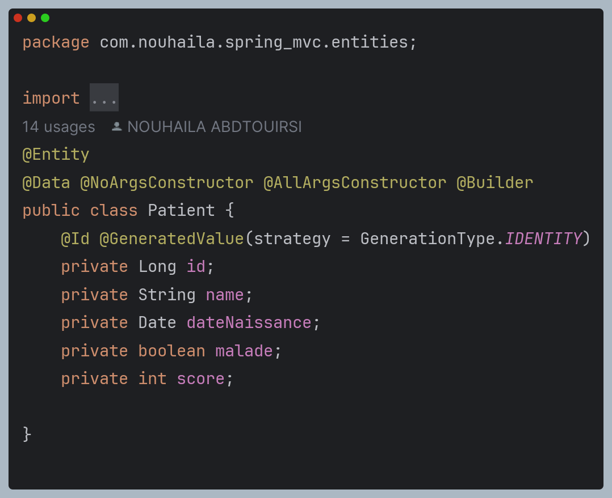
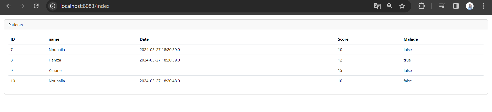
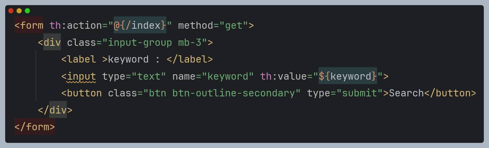
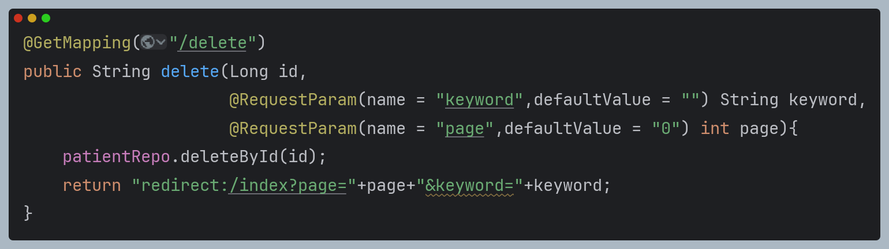

# Patient Management System Using SprinG MVC

<H2> Project Structure :</H2>

1. Créer une application Web JEE basée sur Spring MVC, Thylemeaf et Spring Data JPA qui permet de gérer les patients. L'application doit permettre les fonctionnalités suivantes :
2. Afficher les patients
 - Contrôleur : PatientController
    
 - Vue : patients.html
    
 - Repository : PatientRepository
    
 - Entité : Patient
    
 - Resultat :
    
3. Faire la pagination
La pagination se fait par les deux paramètres `page` et `size` dans l'URL. Par exemple, pour afficher la page 2 avec une taille de 5, l'URL doit être `http://localhost:8080/patients?page=2&size=5` 
pour ce faire la methode index du controleur va passer a la vue la liste des patients, le nombre total de pages et la page courante.
 voir le code precedent pour plus de details.
4. Chercher les patients
on ajoute le parametre keyword dans l'URL pour chercher les patients par nom ou prenom. Par exemple, pour chercher les patients dont le nom contient `ali`, l'URL doit être `http://localhost:8080/patients?keyword=ali`
5. pour ce faire on ajoute un form avec un input de type text et un bouton submit dans la vue patients.html
    
de meme a la methode index du controleur on ajoute un parametre keyword pour recuperer la valeur du champ de recherche.
5. Supprimer un patient
Pour supprimer un patient, on ajoute une methode delete dans le controleur qui prend en parametre l'id du patient a supprimer.

6. Faire des améliorations supplémentaires